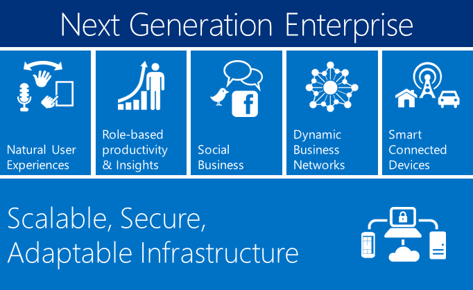
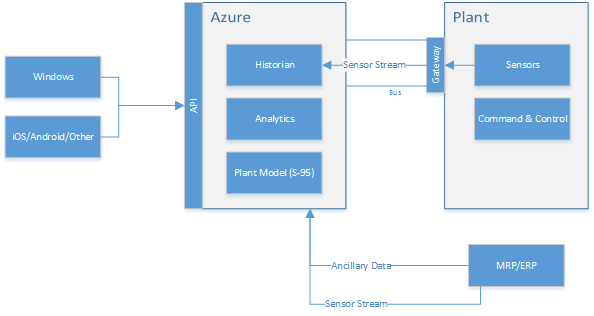
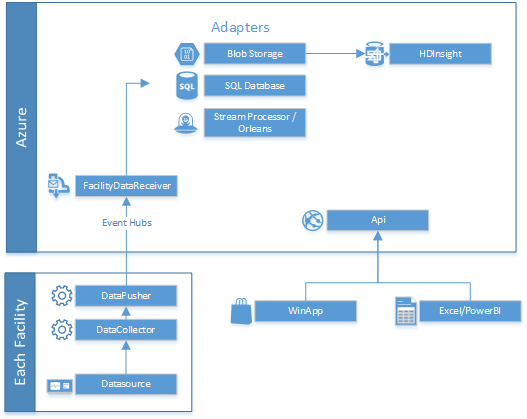

Manufacturing.DevRunner
=======================

# Background

This project is part of a [series of sample projects](https://github.com/search?q=user%3Aytechie+Manufacturing.) focusing on the unique needs of manufacturing, choosing cloud technologies that align with the manufacturing plant of tomorrow.

The projects can be used individually, as a group, or even just select portions. They're designed to be extremely modular and extensible.

#### Azure / On-Premises Co-existence

### This framework is...

* focused on the MES portion of discrete manufacturing.
* an end-to-end data pipeline capable of pulling data from existing systems (using adapters) and ultimately display that information and provide self-service business intelligence.
* decomposable - components are interface-based so that any portions can be used individually. Use as little or as much as you like.
* extensible - because of the modular design approach, the framework can be extended limitlessly.
* open source - licensed under the [Apache 2 license](https://github.com/ytechie/Manufacturing.DevRunner/blob/master/LICENSE)
* using Microsoft technologies such as Azure and Windows, although non-Microsoft technologies will be used where appropriate.
* aligned with tomorrows manufacturing trends such as Industry 4.0.

### This framework is not...

* competing with other Microsoft efforts. It's meant to fill in gaps, not replace existing solutions in development.
* the best way to push data. It simply demonstrates one possible solution.
* the best way to store data. It simply demonstrates one possible solution.
* the best way to process data. It simply demonstrates one possible solution.
* embedded. This framework is a level above the embedded device ecosystem, but can use data generated or collected by devices.
* competing with partners already in this space. This is designed to help accelerate partner application development, and gives them opportunities to add their business value.

# Key Project List

#### Navigate to each repo for documentation specific to that module:

[**Manufacturing.DevRunner**](https://github.com/ytechie/Manufacturing.DevRunner): Contains some of the common files to work with the various manufacturing project resources. It includes a solution file and a console application that makes it easy to run and develop.

[**Manufacturing.Framework**](https://github.com/ytechie/Manufacturing.Framework): Contains common object types and some utility functionality.

[**Manufacturing.DataCollector**](https://github.com/ytechie/Manufacturing.DataCollector): A service that can collect data from various sources on a schedule, as well as accept data through a self-hosted API. The data is stored in a local, persistent cache.

[**Manufacturing.DataPusher**](https://github.com/ytechie/Manufacturing.DataPusher): A service to move data from the local, persistent cache to a cloud provider.

[**Manufacturing.FacilityDataReceiver**](https://github.com/ytechie/Manufacturing.FacilityDataReceiver): An service that processes and dispatches data coming into the cloud.

[**Manufacturing.Azure**](https://github.com/ytechie/Manufacturing.Azure): A cloud service project for Azure deployment.

[**Manufacturing.WinApp**](https://github.com/ytechie/Manufacturing.WinApp): A Windows 8.1 demo application

[**Manufacturing.Api**](https://github.com/ytechie/Manufacturing.Api): An API for interacting with the portion of the framework running in the cloud.

[**Manufacturing.Orleans**](https://github.com/ytechie/Manufacturing.Orleans): An Orleans project for working with manufacturing sensors and other metadata.

# Installation

### Development Environment Prerequisites
1. Windows 8.1
2. Visual Studio 2013
3. [Windows Azure SDK 2.3](http://msdn.microsoft.com/en-us/library/azure/dn655054.aspx)

You can certainly use any individual project, they're all designed to be independent pieces, but if you want to get all of the manufacturing sample projects, clone all of the repositories, preferably into a dedicated directory. Paste the following into your git prompt:

	git clone https://github.com/ytechie/Manufacturing.Framework
	git clone https://github.com/ytechie/Manufacturing.DataCollector
	git clone https://github.com/ytechie/Manufacturing.DataPusher
	git clone https://github.com/ytechie/Manufacturing.FacilityDataReceiver
	git clone https://github.com/ytechie/Manufacturing.DevRunner
	git clone https://github.com/ytechie/Manufacturing.Azure
	git clone https://github.com/ytechie/Manufacturing.WinApp
	git clone https://github.com/ytechie/Manufacturing.Api
	git clone https://github.com/ytechie/Manufacturing.Orleans

Open PowerShell as an administrator and execute the following. Feel free to examine the script, but it's purpose is to set the policies for the self-hosted WebAPI as well as install the required Windows components.

Sample commands:

	Set-ExecutionPolicy Unrestricted
	cd Manufacturing.DevRunner\scripts
	./installDev.ps1

Once you have run this script, feel free to run `Set-ExecutionPolicy Restricted` to change your PowerShell policy back to the default.

### Configuration

After grabbing the source, you'll need to configure some parameters so that the pieces know how to talk to things like the Azure Service Bus. Look inside each project for a `Configuration` folder, and set the settings within the JSON files. These JSON files get loaded into classes at runtime using the [Convention Configuration](https://github.com/ytechie/ConventionConfig) library.

### Bootstrapping
This project uses [Bootstrapper](https://bootstrapper.codeplex.com/), which provides a fluent interface for convention based loading of IoC modules and startup tasks.

### Provider Model

A provider model is used wherever possible to allow individual components to be used independently, substituted, or extended.

[StructureMap](https://github.com/structuremap/structuremap) is used as the preferred IoC, or inversion of control container. It was chosen because of its [automatic configuration options](http://structuremap.github.io/registration/auto-registration-and-conventions/), easy to read error messages, a simple interface for extensibility, its popularity, its ability to [validate the configuration](http://structuremap.github.io/diagnostics/validating-container-configuration/), and its ability to easily [display the currently configured objects](http://structuremap.github.io/diagnostics/whatdoihave/).

In each project, look for a class suffixed with *Container*. For example, *Manufacturing.DataPusher* has a class called `DataPusherContainer`. This class will always implement `IStructureMapRegistration` so that during application startup, the `Register` method of this class is called with the IoC container to configure. The general approach to IoC taken in these projects is to automatically resolve dependencies, and then programmatically handle edge cases with additional IoC configuration.

### Logging
Logging is done through the industry standard Log4Net project.

* Logging is designed to never throw exceptions
* Excellent performance
	* Can buffer
* Extreme flexibility configuring appenders
* Can change appenders at runtime
* For unit tests, a trace appender logs to the console, but there is also a UDP appender that can consolidate all streaming log messages in one location

### Project Planning

Check out the [public Trello planning board](https://trello.com/b/CbdL95oD/manufacturing-framework) for high-level tracking. Bugs should be reported to the corresponding repository issue tracker in GitHub.

### Contributors

#### Microsoft

* [Jason Young](http://ytechie.com)
* [Hanu Kommalapati](http://blogs.msdn.com/b/hanuk/)
* Mike Zawacki
* [Tony Guidici](http://blogs.msdn.com/b/tonyguid/)

#### Skyline Technologies

* Kenny Young
* [Greg Levenhagen](http://greglevenhagen.com)
* Brandon Martinez
* Chris Plate
* Mike Tovbin
* Steve Nelson
* Paul Shepard
* Samuel Lees

# License

Microsoft Developer Experience & Evangelism

Copyright (c) Microsoft Corporation. All rights reserved.

THIS CODE AND INFORMATION ARE PROVIDED "AS IS" WITHOUT WARRANTY OF ANY KIND, EITHER EXPRESSED OR IMPLIED, INCLUDING BUT NOT LIMITED TO THE IMPLIED WARRANTIES OF MERCHANTABILITY AND/OR FITNESS FOR A PARTICULAR PURPOSE.

The example companies, organizations, products, domain names, e-mail addresses, logos, people, places, and events depicted herein are fictitious. No association with any real company, organization, product, domain name, email address, logo, person, places, or events is intended or should be inferred.
